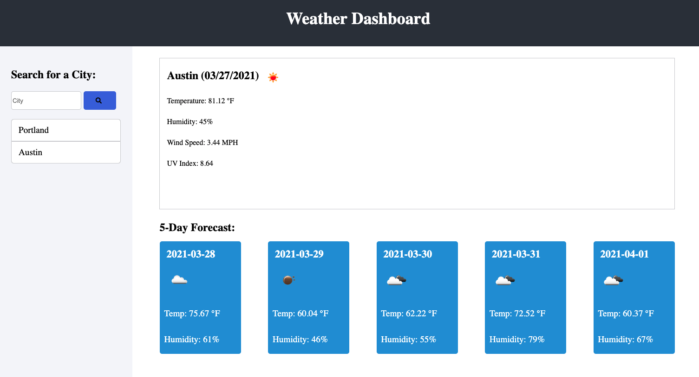

# WeatherDash
  
## Description: 
  Weather Dash displays the weather for a specified city. It also stores the history of previously searched cities.

1. Using grid layouts on Bootstrap, I was able to create a layout with minor CSS edits.
2. I created a search function that pulls from the guery url from Weather Dash and added my user API key at the end of the URL that I declared at the top of the script.js file.
3. I Used local storage to store the previously searched cities for quick access for users. This is for a better user experience. 
4. Using the then function, I was able to extract specific information from the third party app using JSON to find the data to pull into my application. 
5. The 5-day forecast cards holds image icons from the OpenWeatherMap as well as the 5-day forecast data.
  
## Built With:
* HTML
* Bootstrap/CSS
* JavaScript/Jquery 
* Third-party API - OpenWeatherMap

## Table of Contents
* [Usage](#usage)
* [Location](#location)
* [Questions](#questions)
  
## Usage:

## Location:

[URL of deployment](https://chrispruiz.github.io/WeatherDash/)

[GitHub Repository Link](https://github.com/Chrispruiz/WeatherDash.git)

## Questions:
If you have any questions, please feel free to contact me at Chrispruiz@att.net. For more of my work, visit [Chrispruiz](https://github.com/Chrispruiz).
